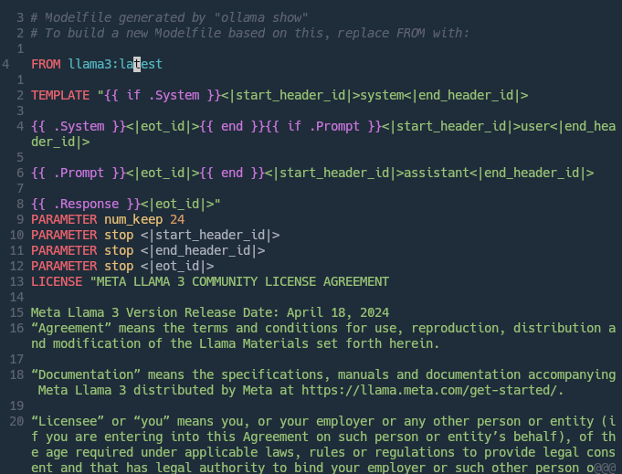

# vim-modelfile

Vim syntax highlighting for [Ollama Model File](https://github.com/ollama/ollama/blob/main/docs/modelfile.md).

## Screenshot

Using [onedark.nvim](https://github.com/navarasu/onedark.nvim) color scheme:



## Installation

Pathogen

```
git clone https://github.com/brainwo/vim-modelfile ~/.vim/bundle/vim-modelfile
```

vim-plug

```vim
Plug 'brainwo/vim-modelfile'
```

Vundle

```vim
Pluging 'brainwo/vim-modelfile'
```

## License

Licensed under The Unlicense. See [LICENSE](./LICENSE) file.
